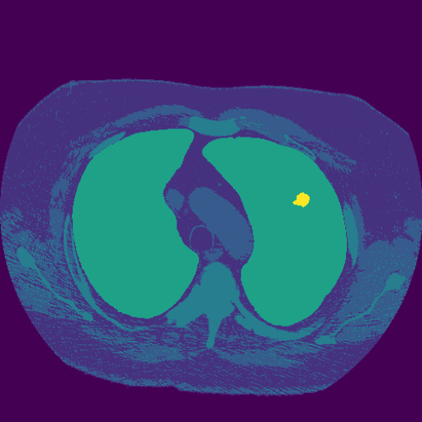

# Computer-Assisted-Learning
Information for the manuscript: "Perceptual Study of Semantically Synthesized 2D Chest CT Image Realism: Quantitative Metrics and Expert Opinion". 
Repository contains code for Computer Assisted Learning; data preprocessing, obtaining synthetic images and realism assessment.

## Data preprocessing
The publicly available dataset of [LIDC-IDRI](https://wiki.cancerimagingarchive.net/display/Public/LIDC-IDRI) is used for this research and should be downloaded via their website (only select CT scans when downloading). To pre-process data:

```
python preprocessing_CT.py
```

Change input and output folder directories before running. Will convert the DICOM files into 2D original images (left image example), with corresponding semantic label map (middle image example) and visual label map (right image example). They will be stored in the folders 'image', 'label', and 'put' respectively. Examples can be seen below.

        

The pre-processed data can be divided into a combined training and validation set, and a test set. In the manuscript, subjects 1 through 900 are used for training validation and 901 through 1010 for testing. Additionally, for the experiments with a smaller training set, the first 2% of the full training set are used. In case of 0.3%, only subject 1 is used (without 20% sampling).

## Obtaining synthetic images
As semantic image synthesis network, the model developed by Park et al. is used, referred to as [SPADE](https://github.com/NVlabs/SPADE) or sometimes as GauGAN. Clone their repo and install their requirements:

``` 
git clone https://github.com/NVlabs/SPADE.git
cd SPADE/
pip install -r requirements.txt
```

To train the model using our previously prepared data:

```
python train.py --name [experiment_name] --dataset_mode custom --label_dir [path_to_'label'_folder] -- image_dir [path_to_'image'_folder] --label_nc 8 --use_vae --niter 25 --niter_decay 25
```

Their code requires the semantic label maps from 'label' as input, as well as the images from 'image' as guiding image. This is similar in both the training and testing phase. During testing the created synthetic images will be saved in an output directory. The results from the manuscript were obtained by training on 4 NVIDIA A40 GPUs.

To obtain synthetic images using the trained model and the test set:

```
python test.py --name [name_of_experiment] --dataset_mode custom --label_dir [path_to_'label'_folder] -- image_dir [path_to_'image'_folder] --use_vae
```

Example of the synthetic image that will be saved:


## Realism assessment
To calculate scores of quantitative metrics:

```
python quantitative__metrics.py
```

Change paths to synthetic and original images and indicate the metric to be applied before running. Possible metrics are; psnr, ssim, ms-ssim and lpips. The FID can be obtained using the `pytorch-fid` package:

```
python -m pytorch_fid path/to/original_images path/to/synthetic_images
```

To set up a similar perceptual study:

```
python qualitative_perceptual_study.py
```

will create 60 folders with quartets of images, and saves information about their origin as .json. Change paths to output directory, and original and synthetic images before running.
